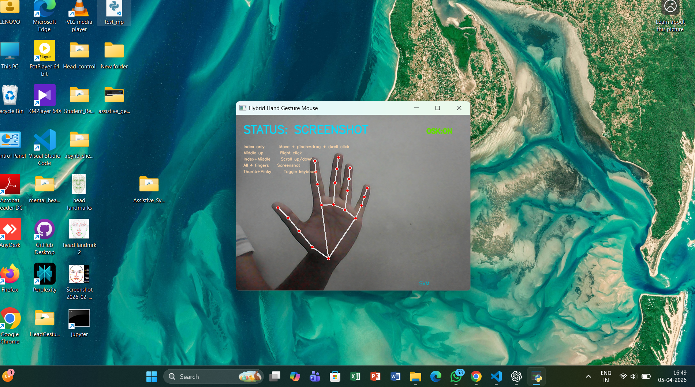

# AI-Based Adaptive Dual-Mode Assistive Computer Control System

## Empowering Touchless Human–Computer Interaction Through AI

An intelligent assistive technology system that enables users to control a computer using **Hand Gestures** or **Head Movements** through a standard webcam. The system combines **Computer Vision**, **Machine Learning**, and **Human–Computer Interaction (HCI)** techniques to provide a flexible, accessible, and touchless computing experience.

This project was developed with a focus on improving accessibility for individuals with motor impairments while also demonstrating the potential of AI-driven interaction systems.

---

## 📌 Project Overview

Traditional computer interaction relies heavily on physical devices such as keyboards and mice. For individuals with physical disabilities or limited motor control, these devices can present significant challenges.

To address this problem, we developed a dual-mode assistive control system that allows users to interact with a computer using either:

- Hand Gesture Recognition
- Head Movement Tracking

The system provides seamless switching between both modes, enabling users to choose the interaction method that best suits their abilities and preferences.

---

## ✨ Key Features

### Hand Gesture Control Mode

- Cursor Navigation
- Left Click
- Double Click
- Right Click
- Scrolling
- Screenshot Capture
- Virtual Keyboard Activation

### Head Movement Control Mode

- Cursor Navigation Using Nose Tracking
- Blink-Based Clicking
- Double Click
- Head Tilt Scrolling
- Screenshot Capture
- Virtual Keyboard Activation
- Pause / Resume Control

### Adaptive System Features

- Real-Time Computer Vision Processing
- Machine Learning-Based Gesture Classification
- Auto-Calibrated User Interaction
- Seamless Mode Switching
- Touchless Computer Control
- Accessibility-Oriented Design

---

## 🏗️ System Architecture

```text
Webcam Input
      │
      ▼
MediaPipe Landmark Detection
      │
      ▼
Feature Extraction
      │
      ▼
Machine Learning Classification (SVM)
      │
      ▼
Action Prediction
      │
      ▼
Computer Control Commands
```

---

## 🛠️ Technology Stack

| Category | Technologies |
|-----------|-------------|
| Programming Language | Python |
| Computer Vision | OpenCV |
| Landmark Detection | MediaPipe |
| Machine Learning | Scikit-Learn |
| Classification Model | Support Vector Machine (SVM) |
| Automation | PyAutoGUI |
| Data Processing | NumPy, Pandas |

---

## 🤖 Machine Learning Pipeline

### Data Collection

Custom datasets were collected for both hand gesture recognition and head movement recognition.

### Feature Extraction

MediaPipe landmarks were extracted from real-time webcam frames and converted into numerical feature vectors.

### Data Preprocessing

- Feature Normalization
- Dataset Cleaning
- Label Encoding

### Model Training

Support Vector Machine (SVM) models were trained separately for:

- Hand Gesture Classification
- Head Movement Classification

### Real-Time Prediction

The trained models predict user intentions and map them to corresponding computer actions.

---

## 📊 Dataset Information

| Dataset | Samples |
|----------|---------|
| Hand Gesture Dataset | 6,782 |
| Head Movement Dataset | 7,000 |
| Total Samples | 13,782 |

---

## 📈 Performance Results

The trained models demonstrated reliable performance for real-time interaction tasks.

### Hand Gesture Model

- Accuracy: **91.5%**

### Head Movement Model

- Accuracy: **92.3%**

Detailed evaluation metrics, confusion matrices, and classification reports are available in the **Result** directory.

---

## 📂 Repository Structure

```text
AI-Based-Adaptive-Dual-Mode-Assistive-Computer-Control-System
│
├── hand_module/
│   ├── control.py
│   ├── train_model.py
│   └── gesture_dataset.csv
│
├── head_module/
│   ├── head_cursorr.py
│   ├── train_svm.py
│   └── final_gesture_dataset.csv
│
├── models/
├── screenshots/
├── Mediapipe_visualizations/
├── Result/
│
├── main_switch.py
├── requirements.txt
├── Mini_Project_Report.pdf
├── Project_Presentation.pdf
└── README.md
```

---

## 🎯 Applications

- Assistive Technology
- Accessibility Solutions
- Human–Computer Interaction
- Smart Workstations
- Touchless Computing Systems
- AI-Based User Interfaces
- Educational Accessibility Tools

---

## 🚀 Future Enhancements

- Eye-Gaze Tracking
- Voice Command Integration
- Deep Learning-Based Gesture Recognition
- Mobile Device Integration
- Cloud-Based Personalization
- Multi-User Support

---

## 📸 Results and Visualizations

The repository includes:

- Confusion Matrices
- Classification Reports
- Performance Metrics
- MediaPipe Landmark Visualizations
- Real-Time System Demonstrations

---

## 👥 Team Members

**Aiswarya K Rejikumar**  
**Athul Krishna N M**  
**Bhanupriya C P**

**B.Tech Computer Science and Engineering (AI & ML)**

**Sree Chitra Thirunal College of Engineering**  
Kerala, India

---

---

## 📸 Project Screenshots

### Cursor Movement


### Right Click Action


### Virtual Keyboard Activation


### Screenshot Capture



---

## 🎓 Academic Project

This project was developed as part of the B.Tech Computer Science and Engineering (AI & ML) curriculum and demonstrates the practical application of Artificial Intelligence, Computer Vision, and Accessibility-Focused Human–Computer Interaction.

---

## 📜 License

This project is intended for academic and educational purposes.
